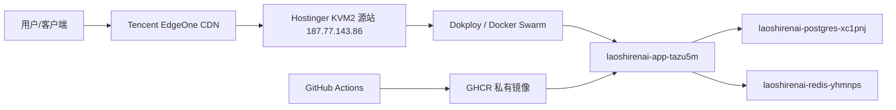

# 老实人 AI 远程环境资产清单

更新时间：2026-05-16 00:29 CST

用途：给团队成员和后续 Codex/AI 线程快速了解老实人 AI 中转站的远程环境、控制台入口、服务器、数据库、域名、CDN、GitHub、镜像和备份操作。新线程执行任何运维任务前，先读本文件，再读本仓库 `AGENTS.md`。

说明：这是可以提交到私有 GitHub 仓库的脱敏共享版本。它记录环境入口、服务名、验证命令和备份方式，但不记录真实密钥。

## 安全边界

- 本文件不保存真实密码、Token、JWT、数据库密码、Redis 密码、GitHub PAT、用户 API Key。
- 真实密钥只允许放在平台密钥、系统 keyring、Dokploy 环境变量、服务器容器环境变量或 `/Users/fujunhao/laoshirenai/secrets.local.env` 这类受保护本地文件里。
- 任何线程都不要把 `/Users/fujunhao/laoshirenai/secrets.local.env`、SSH 私钥、GitHub Token、数据库密码内容打印到聊天或写入教程。
- 需要备份数据库时，不需要读取数据库密码；直接在 PostgreSQL 容器内部使用容器自己的环境变量执行 `pg_dump`。

## 一句话总览

这是一个部署在 Hostinger KVM2 马来西亚服务器上的 DragonCode-sub2api 中转站。代码在 GitHub 私有仓库，GitHub Actions 构建 Docker 镜像并推送到 GHCR，生产环境由 Dokploy/Docker Swarm 管理，业务拆成 3 个服务：Application、PostgreSQL、Redis。域名在 Spaceship，访问加速走腾讯云 EdgeOne。



## 关键本地路径

| 类型 | 路径 | 说明 |
| --- | --- | --- |
| 总工作区 | `/Users/fujunhao/laoshirenai` | 项目总目录 |
| 源码仓库 | `/Users/fujunhao/laoshirenai/DragonCode-sub2api` | 改代码、提交、推送都在这里 |
| 部署日志 | `/Users/fujunhao/laoshirenai/log.md` | 关键操作、错误和解决方式都追加在这里 |
| 环境资产清单 | `docs/ops/ENVIRONMENTS.md` | 本文件，团队共享版本 |
| 运维教程目录 | `/Users/fujunhao/laoshirenai/tutorials/03-operation` | 运行、备份、排错教程 |
| 本地密钥备份 | `/Users/fujunhao/laoshirenai/secrets.local.env` | owner 本机受保护文件，不要打印内容，也不要提交 |
| 部署 Skill | `/Users/fujunhao/.agents/skills/laoshirenai-deploy/SKILL.md` | 后续改代码/推送/上线必须先读 |

## 后续线程必须遵守的规则

- 普通修 bug、改前端、改后端：只做到测试、commit、push、GitHub Actions 镜像构建成功，然后停止。
- 除非用户明确说“上线 / 发布 / 部署到生产”，否则不要更新生产服务。
- 生产部署不是 Compose，不要改成 Compose。
- 不要重建 PostgreSQL 或 Redis。
- 不要使用 `root@laoshirenai.com` SSH；该域名在 CDN 后面，不是 SSH 入口。
- 服务器 SSH 统一使用本地 alias：`laoshirenai-hostinger`。

## 控制台与链接

| 服务 | 链接 | 状态/说明 |
| --- | --- | --- |
| 生产站点 | `https://laoshirenai.com` | 已验证：HTTP 200，响应头 `server: TencentEdgeOne` |
| www 站点 | `https://www.laoshirenai.com` | 已验证：HTTP 200，响应头 `server: TencentEdgeOne` |
| API 域名 | `https://api.laoshirenai.com` | 已验证：`/health` 返回 `{"status":"ok"}` |
| OpenAI 兼容 Base URL | `https://api.laoshirenai.com/v1` | 未带 API Key 访问 `/models` 返回 401，属于正常鉴权 |
| Claude/Anthropic Base URL | `https://api.laoshirenai.com` | Claude 类客户端使用根域，不强制 `/v1` |
| Antigravity Claude Base URL | `https://api.laoshirenai.com/antigravity` | Antigravity Claude 专用路径 |
| 管理员登录页 | `https://laoshirenai.com/login` | 管理员邮箱见下文，密码不写入本文档 |
| Dokploy 面板 | `http://187.77.143.86:3000` | 已验证：HTTP 200，需要登录 |
| Hostinger VPS 面板 | `https://hpanel.hostinger.com/vps` | 浏览器登录后访问；命令行会被防护拦截为 403 |
| Spaceship 域名列表 | `https://www.spaceship.com/application/domain-list-application` | 浏览器登录后访问；命令行会被防护拦截为 403 |
| 腾讯云 EdgeOne 控制台 | `https://console.cloud.tencent.com/edgeone` | 已验证：会跳转腾讯云登录页 |
| EdgeOne 国际站 | `https://edgeone.ai` | 已验证：HTTP 200 |
| GitHub 私有仓库 | `https://github.com/nobody396/laoshiren-ai-gateway` | 已通过 `gh` 验证；匿名网页访问 404 是私有仓库正常表现 |
| GitHub Actions workflow | `https://github.com/nobody396/laoshiren-ai-gateway/actions/workflows/docker-image.yml` | 已通过 `gh` 验证最近 3 次均成功；匿名网页访问可能 404 |
| GHCR 镜像包 | `https://github.com/nobody396/laoshiren-ai-gateway/pkgs/container/laoshiren-ai-gateway` | 私有包；已通过 `gh api` 验证存在 `main` 标签 |
| DragonCode 上游源码 | `https://github.com/bozhouDev/DragonCode-sub2api` | 上游私有或受限；匿名网页访问 404 属正常情况 |

## GitHub 与镜像环境

| 项 | 当前值 |
| --- | --- |
| GitHub 私有仓库 | `nobody396/laoshiren-ai-gateway` |
| 默认分支 | `main` |
| 本地 remote origin | `git@github-work:nobody396/laoshiren-ai-gateway.git` |
| 本地 remote upstream | `git@github-work:bozhouDev/DragonCode-sub2api.git` |
| upstream push | `DISABLED`，不要推上游 |
| GitHub Actions workflow | `.github/workflows/docker-image.yml` |
| GHCR 镜像 | `ghcr.io/nobody396/laoshiren-ai-gateway:main` |
| 最近已验证镜像标签 | `main`、`d5bc84140c7ed45b158c7e8804f794b081f3211b` |
| GitHub CLI 活跃账号 | `nobody396` |
| GitHub CLI Token 保存位置 | 系统 keyring，本文档不保存 token |
| Git SSH alias | `github-work` |
| Git SSH key 路径 | `~/.ssh/id_ed25519_github_work`，不要打印私钥内容 |

常用检查命令：

```bash
cd /Users/fujunhao/laoshirenai/DragonCode-sub2api
git status --short
git remote -v
gh repo view nobody396/laoshiren-ai-gateway --json nameWithOwner,url,isPrivate,defaultBranchRef
gh run list -R nobody396/laoshiren-ai-gateway --workflow docker-image.yml --branch main --limit 5
```

## 服务器环境

| 项 | 当前值 |
| --- | --- |
| 云服务商 | Hostinger |
| 套餐 | KVM2 |
| 机房 | Malaysia - Kuala Lumpur |
| 操作系统 | Ubuntu 24.04 LTS |
| 源站 IP | `187.77.143.86` |
| SSH 用户 | `root` |
| SSH alias | `laoshirenai-hostinger` |
| SSH key 路径 | `~/.ssh/id_ed25519_hostinger_laoshirenai`，不要打印私钥内容 |
| Docker context | `laoshirenai-hostinger` -> `ssh://laoshirenai-hostinger` |
| Dokploy 面板 | `http://187.77.143.86:3000` |
| 业务公开入口 | 通过 EdgeOne + Traefik 访问，不直接暴露 app 8080 |

本地 SSH 配置摘要：

```sshconfig
Host laoshirenai-hostinger
  HostName 187.77.143.86
  User root
  IdentityFile ~/.ssh/id_ed25519_hostinger_laoshirenai
  IdentitiesOnly yes
```

常用检查命令：

```bash
ssh laoshirenai-hostinger 'hostname'
docker context inspect laoshirenai-hostinger
docker --context laoshirenai-hostinger service ls
```

## Dokploy / Docker Swarm 服务

业务服务：

| 服务 | 镜像 | 副本 | 说明 |
| --- | --- | --- | --- |
| `laoshirenai-app-tazu5m` | `ghcr.io/nobody396/laoshiren-ai-gateway:main` | `1/1` | 业务应用 |
| `laoshirenai-postgres-xc1pnj` | `postgres:18-alpine` | `1/1` | 业务数据库 |
| `laoshirenai-redis-yhmnps` | `redis:8-alpine` | `1/1` | 业务缓存/队列 |

Dokploy 自身服务：

| 服务 | 镜像 | 副本 | 说明 |
| --- | --- | --- | --- |
| `dokploy` | `dokploy/dokploy:v0.29.4` | `1/1` | Dokploy 面板 |
| `dokploy-postgres` | `postgres:16` | `1/1` | Dokploy 自身数据库，不是业务库 |
| `dokploy-redis` | `redis:7` | `1/1` | Dokploy 自身 Redis，不是业务 Redis |

共享网络：

| 项 | 当前值 |
| --- | --- |
| 网络名 | `dokploy-network` |
| 网络 ID | `38tsk9roizfla98u47frul1uh` |
| 类型 | Docker overlay / swarm / attachable |

业务 volumes：

| Volume | 挂载点 | 用途 |
| --- | --- | --- |
| `laoshirenai-app-tazu5m-data` | `/app/data` | 应用本地数据 |
| `laoshirenai-postgres-xc1pnj-data` | `/var/lib/postgresql/18/docker` | PostgreSQL 数据 |
| `laoshirenai-redis-yhmnps-data` | `/data` | Redis 持久化数据 |

## 应用环境变量

以下是生产 app 服务当前使用的环境变量。真实敏感值已隐藏。

```env
ADMIN_EMAIL=collabwithjerrys@pm.me
ADMIN_PASSWORD=<redacted>
AUTO_SETUP=true
DATABASE_CONN_MAX_IDLE_TIME_MINUTES=5
DATABASE_CONN_MAX_LIFETIME_MINUTES=30
DATABASE_DBNAME=sub2api
DATABASE_HOST=laoshirenai-postgres-xc1pnj
DATABASE_MAX_IDLE_CONNS=10
DATABASE_MAX_OPEN_CONNS=50
DATABASE_PASSWORD=<redacted>
DATABASE_PORT=5432
DATABASE_SSLMODE=disable
DATABASE_USER=sub2api
JWT_EXPIRE_HOUR=24
JWT_SECRET=<redacted>
LOG_ENV=production
LOG_FORMAT=json
LOG_LEVEL=info
LOG_SERVICE_NAME=laoshirenai-gateway
REDIS_DB=0
REDIS_ENABLE_TLS=false
REDIS_HOST=laoshirenai-redis-yhmnps
REDIS_MIN_IDLE_CONNS=10
REDIS_PASSWORD=<redacted>
REDIS_POOL_SIZE=1024
REDIS_PORT=6379
RUN_MODE=standard
SERVER_HOST=0.0.0.0
SERVER_MODE=release
SERVER_PORT=8080
TOTP_ENCRYPTION_KEY=<redacted>
TZ=Asia/Shanghai
```

## 数据库环境

| 项 | 当前值 |
| --- | --- |
| 数据库服务 | `laoshirenai-postgres-xc1pnj` |
| 镜像 | `postgres:18-alpine` |
| PostgreSQL 版本 | `PostgreSQL 18.3` |
| 数据库名 | `sub2api` |
| 数据库用户 | `sub2api` |
| 端口 | `5432`，只在 Docker 网络内使用 |
| 数据 volume | `laoshirenai-postgres-xc1pnj-data` |
| 挂载点 | `/var/lib/postgresql/18/docker` |
| 健康验证 | `pg_isready` 已通过 |

查找当前数据库容器：

```bash
docker --context laoshirenai-hostinger ps --filter 'name=laoshirenai-postgres' --format '{{.Names}}'
```

验证数据库可用：

```bash
PG_CONTAINER=$(docker --context laoshirenai-hostinger ps --filter 'name=laoshirenai-postgres' --format '{{.Names}}' | head -n1)
docker --context laoshirenai-hostinger exec "$PG_CONTAINER" sh -lc 'pg_isready -U "$POSTGRES_USER" -d "$POSTGRES_DB"'
```

数据库备份推荐命令：

```bash
BACKUP_DIR=/Users/fujunhao/laoshirenai/backups/postgres
mkdir -p "$BACKUP_DIR"
PG_CONTAINER=$(docker --context laoshirenai-hostinger ps --filter 'name=laoshirenai-postgres' --format '{{.Names}}' | head -n1)
docker --context laoshirenai-hostinger exec "$PG_CONTAINER" sh -lc \
  'pg_dump -U "$POSTGRES_USER" -d "$POSTGRES_DB" --format=custom --no-owner --no-acl' \
  > "$BACKUP_DIR/sub2api-$(date +%Y%m%d-%H%M%S).dump"
ls -lh "$BACKUP_DIR"
```

说明：

- 这个命令不会把数据库密码写入本地。
- 备份文件保存在本机 `/Users/fujunhao/laoshirenai/backups/postgres`。
- 新线程做备份时，先创建 `backups/postgres` 目录，再执行以上命令。
- 备份完成后要把文件大小、文件路径、时间写入 `log.md`。

## Redis 环境

| 项 | 当前值 |
| --- | --- |
| Redis 服务 | `laoshirenai-redis-yhmnps` |
| 镜像 | `redis:8-alpine` |
| 端口 | `6379`，只在 Docker 网络内使用 |
| DB | `0` |
| TLS | `false` |
| 数据 volume | `laoshirenai-redis-yhmnps-data` |
| 挂载点 | `/data` |
| 健康验证 | `redis-cli ping` 返回 `PONG` |

验证 Redis 可用：

```bash
REDIS_CONTAINER=$(docker --context laoshirenai-hostinger ps --filter 'name=laoshirenai-redis' --format '{{.Names}}' | head -n1)
docker --context laoshirenai-hostinger exec "$REDIS_CONTAINER" sh -lc 'redis-cli -a "$REDIS_PASSWORD" ping 2>/dev/null'
```

## 域名、DNS、CDN

| 项 | 当前值 |
| --- | --- |
| 主域名 | `laoshirenai.com` |
| 域名购买/管理 | Spaceship |
| DNS 配置位置 | Spaceship Advanced DNS |
| CDN / 边缘加速 | 腾讯云 EdgeOne |
| 源站 | Hostinger 源站 IP `187.77.143.86` |
| HTTPS | EdgeOne 免费边缘证书，自动验证 |

当前加速域名：

| 域名 | EdgeOne 目标 | 公开解析验证 |
| --- | --- | --- |
| `laoshirenai.com` | `laoshirenai.com.eo.dnse2.com` | Google DNS A：`43.169.13.163`、`43.169.14.163` |
| `www.laoshirenai.com` | `www.laoshirenai.com.eo.dnse2.com` | Google DNS A：`43.169.13.163`、`43.169.14.163` |
| `api.laoshirenai.com` | `api.laoshirenai.com.eo.dnse2.com` | Google DNS A：`43.169.13.163`、`43.169.14.163` |

EdgeOne 所有权验证 TXT：

```text
edgeonereclaim.laoshirenai.com TXT reclaim-nbnhs2hnbimw4op0037k60adix0aal9f
```

EdgeOne 规则：

| 规则名 | 作用域 | 作用 |
| --- | --- | --- |
| `网站加速-www.laoshirenai.com` | `www.laoshirenai.com` | 网站静态资源加速，节点缓存 TTL 30 天 |
| `网站加速-laoshirenai.com` | `laoshirenai.com` | 裸域名网站静态资源加速，节点缓存 TTL 30 天 |
| `API动态不缓存-api.laoshirenai.com` | `api.laoshirenai.com` | API 动态请求不缓存，避免流式输出和鉴权出问题 |

DNS/HTTP 验证命令：

```bash
for host in laoshirenai.com www.laoshirenai.com api.laoshirenai.com; do
  echo "== $host =="
  curl -fsSI "https://$host" | awk 'BEGIN{IGNORECASE=1} /^HTTP\// || /^server:/ || /^eo-cache-status:/ {print}'
done
```

注意：本机如果开了代理或 TUN，`dig` 可能返回 `198.18.x.x` fake-ip。要看真实公网 DNS，优先用 Google DNS over HTTPS：

```bash
curl -fsS 'https://dns.google/resolve?name=api.laoshirenai.com&type=A' | jq
```

## 系统后台配置

| 配置项 | 当前值 |
| --- | --- |
| 系统 API 端点地址 | `https://api.laoshirenai.com` |
| 管理员邮箱 | `collabwithjerrys@pm.me` |
| 管理员密码 | 不写入本文档；在生产环境变量/系统内保存 |
| 用户访问主站 | `https://laoshirenai.com` |
| 后台登录页 | `https://laoshirenai.com/login` |

客户端 Base URL 规则：

- 系统设置里的统一端点：`https://api.laoshirenai.com`
- OpenAI 兼容客户端手动填写：`https://api.laoshirenai.com/v1`
- Claude/Anthropic 客户端手动填写：`https://api.laoshirenai.com`
- Antigravity Claude：`https://api.laoshirenai.com/antigravity`

## 发布与不上线规则

默认只推送，不上线：

```bash
cd /Users/fujunhao/laoshirenai/DragonCode-sub2api
git status --short
# 修改代码、测试、commit、push
/Users/fujunhao/.agents/skills/laoshirenai-deploy/scripts/release-after-push.sh
```

只有用户明确要求“上线 / 发布 / 部署到生产”时，才允许执行：

```bash
/Users/fujunhao/.agents/skills/laoshirenai-deploy/scripts/release-after-push.sh --deploy --confirm-production-deploy
```

生产服务手动更新命令，只有明确上线时才可用：

```bash
docker --context laoshirenai-hostinger service update \
  --force \
  --image ghcr.io/nobody396/laoshiren-ai-gateway:main \
  laoshirenai-app-tazu5m
```

## 常见错误

| 现象 | 原因 | 正确处理 |
| --- | --- | --- |
| `ssh root@laoshirenai.com` 失败 | 域名在 EdgeOne 后面，不是 SSH 入口 | 使用 `ssh laoshirenai-hostinger` |
| GitHub 网页打开私有仓库 404 | 私有仓库匿名访问隐藏 | 用已登录浏览器或 `gh repo view` 验证 |
| GHCR 包网页 404 | 私有包匿名访问隐藏 | 用 `gh api /user/packages/container/laoshiren-ai-gateway/versions` 验证 |
| Hostinger/Spaceship 命令行访问 403 | 控制台防护和登录限制 | 用浏览器登录访问 |
| `/v1/models` 返回 401 | 未带 API Key | 正常鉴权结果，不代表 API 坏了 |
| `dig` 返回 `198.18.x.x` | 本机代理 fake-ip | 用 Google DNS over HTTPS 验证 |
| 网站 200 但慢 | 静态资源体积、字体、CDN 缓存命中率问题 | 先看响应头是否 `server: TencentEdgeOne`，再做前端资源优化 |
| 误以为要 Compose 部署 | 旧教程有 Compose 方案 | 当前生产固定为 Dokploy 拆分服务，不改 Compose |

## 给新线程的最短提示词

```text
先阅读 /Users/fujunhao/laoshirenai/ENVIRONMENTS.md 和 /Users/fujunhao/laoshirenai/log.md。
本项目生产不是 Compose，是 Dokploy/Docker Swarm 拆分服务。
普通代码修改只推送并等待 GitHub Actions 成功，不要上线。
除非我明确说“上线/发布/部署到生产”，否则不要更新生产服务。
真实密码、Token、JWT、数据库密码不要写入文档或聊天。
```
