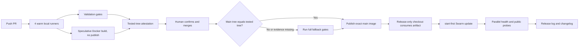

# Fast, verified production release

## Goal

Minimize waiting without weakening the release contract:

- human acceptance is required before merge;
- merge publishes an immutable image but does not deploy;
- production accepts only CI-verified `image@sha256`;
- a failed proof, missing runner, or missing artifact falls back safely instead
  of skipping validation;
- rollback remains an exact previous digest.

## Critical path



## What runs in parallel

PR CI classifies changed paths and runs only the smallest safe matrix:

| Change | Required work |
| --- | --- |
| Frontend only | typecheck/boundaries, frontend tests, production build/budget, non-publishing Docker build |
| Backend only | backend tests/lint, deterministic integration, non-publishing Docker build |
| Docs only | path classification and tested-tree attestation |
| CI/release/unknown | full matrix |

Unknown paths fail open to the full matrix. On PRs, the Docker job never
publishes. On `main`, publishing is allowed only after a verified tested-tree
match or successful fallback gates.

## Operational sequence

1. Before push/merge, keep four local runners warm for ten minutes:

   ```bash
   /Users/fujunhao/laoshirenai/.agents/skills/laoshirenai-deploy/scripts/manage_local_runners.py \
     auto-start --count 4 --idle-grace-seconds 600
   ```

2. Wait for PR CI and human product confirmation; merge the approved PR.
3. Main CI verifies the tested tree and publishes the exact commit artifact.
4. Only after explicit production authorization:

   ```bash
   /Users/fujunhao/laoshirenai/.agents/skills/laoshirenai-deploy/scripts/release-after-push.sh \
     --deploy --confirm-production-deploy
   ```

5. Record exact commit, digest, previous digest, CI run and health evidence in
   `/Users/fujunhao/laoshirenai/log.md`.
6. Run the mandatory changelog publisher and review/publish or record an
   intentional skip.

The release command maintains
`/Users/fujunhao/laoshirenai/local/release-worktree`; do not edit it manually.

## Failure and rollback

- Missing or mismatched tested-tree evidence: main CI runs the full test matrix.
- No idle runner: start four runners; do not replace self-hosted jobs with
  unreviewed infrastructure.
- Dirty release-only checkout: release stops. Inspect it instead of destroying
  unknown changes.
- Health failure: Docker Swarm rolls back automatically; verify the exact
  resulting digest.
- Manual rollback:

  ```bash
  /Users/fujunhao/laoshirenai/.agents/skills/laoshirenai-deploy/scripts/rollback.sh \
    ghcr.io/nobody396/laoshiren-ai-gateway@sha256:<previous-digest>
  ```

Never deploy or roll back by `:main`.
