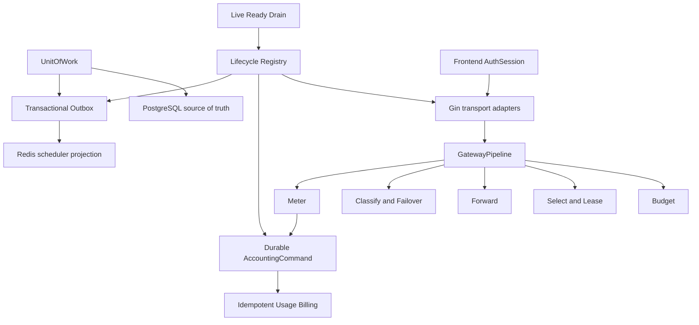

# Production Architecture Hardening and Maintenance Plan

## Summary

本计划把当前系统收敛为“模块化单体 + 强事务边界 + 持久化异步任务 + 可验证发布”。北京时间 2026-07-11 01:00–05:00 的维护窗口只允许发布窗口前已经完成、测试通过、可按精确镜像 digest 回滚的止血批次；其余重构在独立分支逐批完成，不在停服后现场开发。

本计划是本轮修复重构的唯一决策依据，并已经完成一次集中式对抗审查。实施时不对每个 feature 或 fix 重复做计划审查或对抗审查；每个单元只执行“开发 -> 测试 -> 失败则修复 -> 通过则提交并进入下一单元”。只有范围偏离、安全不变量被破坏、或回滚前提被证伪时，才重新打开架构决策。

---

## Problem Frame

系统当前能够提供服务，但架构审查在 `main@c1372aba` 上确认了四类根问题：

1. **数据方向错误。** 自定义 migration runner 把含有 Goose `Up` 和 `Down` 的整份 SQL 一次执行，生产迁移记录与实际 schema 已经出现分叉；advisory lock 又通过连接池获取和释放，不能保证使用同一 PostgreSQL session。
2. **关键提交边界不完整。** 注册与邀请码、账号关系与 scheduler outbox、usage 与扣费都可能分别提交，进程退出或第二步失败后留下不可恢复或只能最终修复的不一致。
3. **安全和会话所有权分叉。** 外部 iframe URL 可以带完整 access JWT，Axios 与 Pinia 又各自维护 token refresh 状态机。
4. **发布对象不可证明。** `/health` 无条件返回 200；集成测试没有进入 CI；测试 workflow、镜像 workflow 和可变 `:main` 标签不能证明“部署的就是测试过的 artifact”。

此时直接拆微服务或先拆大文件会扩大故障面。正确顺序是先止血和建立可验证发布，再收紧事务与异步边界，最后渐进拆分 Gateway 和前端巨型组件。

---

## Scope Boundaries

### In scope

- 修复 migration 执行方向、连接级 advisory lock 和已知生产 schema 副作用。
- 建立真实 liveness/readiness、draining 语义、集成测试门禁和精确 digest 发布。
- 删除外部 URL 中的 bearer token，并建立 audience-bound 一次性 SSO ticket。
- 统一前端 `AuthSession`。
- 建立 `UnitOfWork`、transactional outbox 和 durable accounting command。
- 在保持单体部署的前提下建立 `GatewayPipeline`、`Lifecycle`、`AccountDraft` 和清晰的 API/UI 边界。
- 收敛 lockfile、secret、checkout、权限和架构 guardrail 的 source of truth。

### Deferred from the first maintenance release

- durable accounting、完整 `UnitOfWork`、全量 transactional outbox、完整 `AuthSession`、Gateway 拆分和巨型表单拆分。
- 任何没有在维护窗口前完成全部测试和 CI 的代码。
- 需要外部 iframe 消费端配合，但尚未完成端到端契约验证的 SSO 切换。

### Out of scope

- 拆微服务、切换数据库或 Redis、重建生产基础设施。
- 编辑任何已执行 migration 或伪造其 checksum。
- 用客户 API key、客户余额或客户额度做 smoke test。
- 在本轮顺手重做产品 UI、模型路由策略或业务定价。
- 为维护窗口临时引入未经演练的新边缘代理或维护页。

---

## Execution and Review Policy

- **Single review.** 本计划只做一次集中式对抗审查；下游实现不得为每个 U 单元重新规划或反复调用对抗审查。
- **Normal development loop.** 每个 U 单元按 characterization test（需要时）-> 实现 -> 相关测试 -> 全量门禁 -> 修复 -> commit 执行。
- **One logical commit per unit.** 不把多个高风险边界塞进同一提交；失败时可以按提交回退。
- **No production before the window.** 窗口前只允许本地分支、测试、CI、镜像构建和只读核验；不得修改生产数据、停止服务或部署。
- **The window is a release window, not a coding window.** 北京时间 00:30 前若候选版本、集成测试、迁移演练、备份方案或 digest 未准备好，则取消停机和发布。
- **Final integrated gate is verification, not another architecture review.** 发布前只核验计划中已经定义的验收项。
- **Reopen conditions.** 仅当出现未覆盖的数据破坏路径、凭证暴露、旧版本无法在新 schema 上启动、精确 digest 无法回滚，或实施必须越过本计划范围时暂停并重新决策。

---

## Requirements

### Plan and release control

- R1. 本计划是本轮实现与维护操作的唯一决策依据，实施器不得自行扩大维护批次。
- R2. 全程只进行一次计划级对抗审查，不进行逐 feature 或逐 fix 的重复审查。
- R3. 生产服务在候选 artifact、测试、CI、备份和回滚门禁全部满足前保持不变。
- R4. 北京时间 04:00 是最终 go/no-go 截止，05:00 前旧版或新版必须至少有一个健康版本在线。

### Migration and schema safety

- R5. 已执行 migration 永远不可修改；checksum 继续基于原始完整文件计算。
- R6. runner 对带 Goose marker 的文件只执行 `Up` 段，对不带 marker 的历史文件保持现有行为，并拒绝歧义或畸形 marker。
- R7. PostgreSQL advisory lock 的获取、整个迁移过程和释放绑定同一 `*sql.Conn` session。
- R8. 新增 forward-only、幂等、向后兼容的补偿 migration，恢复已知被 `Down` 段撤销的 schema/data；补偿不删除旧列，不依赖回滚 SQL。
- R9. CI 必须覆盖空库全量迁移、受损历史状态升级、重复执行、并发 runner、关键表/索引/回填和旧版本兼容。

### Security and frontend session

- R10. 任意外部 iframe 或跳转 URL 都不得包含 access JWT、refresh token、API key 或用户身份明文参数。
- R11. SSO ticket 必须短 TTL、一次性消费、绑定规范化 HTTPS audience 和用途，并在签发与兑换两端校验允许的 origin。
- R12. 前端只有一个 `AuthSession` 拥有 access token、rotating refresh token、过期时间、refresh mutex、持久化和定时器。
- R13. transport 只返回 typed API errors，不直接操作 Pinia、路由或 UI；现有 storage key 和登录兼容性在迁移期间保持。

### Transaction and asynchronous consistency

- R14. 注册用户、允许分组与邀请码消费必须位于同一个可回滚 `UnitOfWork` 中。
- R15. 账号关系变更与 scheduler outbox event 必须同事务提交；空分组绑定仍发出失效事件，outbox 错误不得吞掉。
- R16. outbox dedup 必须考虑 payload 或显式幂等键，不能仅按一秒时间窗吞掉有意义的连续状态变化。
- R17. usage accounting command 在持久化后必须可重试、可重放、幂等和可观察，并拥有 `pending -> processing -> billed|retry|dead` 状态。
- R18. durable accounting 明确只保证 command 成功提交后的不丢失；“上游已成功但 command 尚未提交时进程崩溃”的最后窗口必须被监控和文档化，不得宣称完全消除。

### Operability and architecture

- R19. `/livez` 只表达进程存活，`/readyz` 使用有界超时检查 DB、Redis 和 draining 状态；兼容期 `/health` 与 readiness 一致，不能假绿。
- R20. CI 通过后只构建或选择与精确 commit 对应的镜像，发布记录并部署 digest，回滚也使用已记录 digest。
- R21. 后端保持模块化单体，通过 `GatewayPipeline`、`Lifecycle` 和 ports/adapters 降低 God Object，而不是拆微服务。
- R22. 前端通过 `AccountDraft`、platform adapter、单向 API 依赖和路由级 lazy chunk 降低巨型组件与入口包体积。
- R23. secret 值只由 Agent Switch 管理；仓库、文档、日志、备份清单和测试 fixture 只能出现 secret name 或脱敏值。
- R24. checkout 角色、lockfile、depguard、secret scan 和文档契约必须有机器可验证的单一 source of truth。

---

## Key Technical Decisions

- KTD1. **保持模块化单体。** 当前核心风险来自边界不原子和发布不可验证，拆微服务只会增加网络与运维一致性问题。
- KTD2. **先止血，后结构重构。** 第一维护批次只含 migration 安全、readiness/drain、integration gate、精确 digest 发布；可独立验证的无凭证 iframe 止血补丁只能在门禁全过后附带。
- KTD3. **forward-only expand-contract。** 数据库只做向前兼容修复；应用回滚到旧 digest，不执行 schema Down。旧应用必须能运行在新 schema 上。
- KTD4. **原始文件 checksum 与可执行 SQL 分离。** checksum 使用未修改的完整 migration 内容，执行前只提取合法 `Up` 段，避免破坏历史记录。
- KTD5. **连接级迁移锁。** runner 先获取专用 `*sql.Conn`，所有锁和 migration metadata 操作均通过该连接完成；事务也从该连接开始。
- KTD6. **readiness 是流量资格。** 进程先标记 draining，再停止接收新流量并排空；liveness 不检查外部依赖，避免故障时重启风暴。
- KTD7. **build once, deploy by digest。** `:main` 可以保留为人类可读别名，但不得再作为部署输入或回滚点。
- KTD8. **维护窗口只做已演练发布。** 不因为已经公告停机就强行部署；00:30 preflight 不通过则保持现网运行。
- KTD9. **外部 URL 默认无凭证。** 未完成 ticket exchange 契约的 origin 只获得无认证 URL，不保留 raw-token fallback。
- KTD10. **一个 AuthSession owner。** Axios interceptor 不再自行刷新或写 localStorage；并发 401 通过同一 refresh promise 合并。
- KTD11. **UnitOfWork 是事务入口。** repository 从 context 解析 transactional Ent client/SQL executor；只有最外层拥有 commit/rollback。
- KTD12. **transactional outbox 优先于缓存即时性。** 业务写入和失效事件原子提交，consumer 至少一次处理并保持幂等；不再靠日志和 300 秒重建兜底正确性。
- KTD13. **durable accounting 复用现有幂等扣费。** 新 command 状态机编排持久化、重试和 dead-letter，现有 billing fingerprint 仍是最终防重复边界。
- KTD14. **Gateway 按阶段抽取，不重写。** 先以 characterization tests 锁定行为，再依次抽出 budget、select/lease、forward、classify/failover、meter stages。
- KTD15. **Lifecycle 显式注册。** provider 构造函数不再隐式 `Start()`；root context 驱动正序启动、反序限时停止和统一 drain。
- KTD16. **所有真实付费 smoke 使用自有身份。** 默认 user id `2`；只有明确属于 admin-owned 的身份可作为备选，任何找不到合规身份的情况都记为 `action-required`。

---

## High-Level Technical Design

### Target modular monolith



### Release flow

```mermaid
flowchart TB
  BR["Isolated branch"] --> T["Unit and deterministic integration tests"]
  T --> CI["Required CI gates"]
  CI --> IMG["Image for exact commit"]
  IMG --> DIG["Resolve and record digest plus OCI revision"]
  DIG --> DRILL["Restore backup and migration drill"]
  DRILL --> PRE{ "00:30 preflight" }
  PRE -->|fail| KEEP["Keep old production online and announce delay"]
  PRE -->|pass| MAINT["Enable independent maintenance surface"]
  MAINT --> BACKUP["Fresh verified backup and stop app writers"]
  BACKUP --> DEPLOY["Deploy exact digest"]
  DEPLOY --> READY{ "/readyz and smoke" }
  READY -->|pass| OPEN["Restore traffic and observe"]
  READY -->|fail| ROLLBACK["Deploy recorded old digest; keep additive schema"]
```

### Batch sequencing

| Batch | Units | Production posture |
|---|---|---|
| A: P1 release safety | U0–U5 | Candidate for 2026-07-11 only when all pre-window gates pass |
| B: auth and transaction consistency | U6–U9 | Separate releases; characterization/integration first |
| C: runtime modularity | U10–U12 | Shadow/strangler rollout; no big-bang replacement |
| D: frontend and governance | U13–U15 | Independent deploys with bundle/security budgets |

---

## Implementation Units

### U0. Freeze the baseline and make integration execution deterministic

- **Goal:** Prove that database/Redis integration tests really ran and make every later unit start from a reproducible baseline.
- **Requirements:** R1–R3, R9, R20.
- **Files:**
  - `.github/workflows/ci.yml`
  - `Makefile`
  - `backend/Makefile`
  - `backend/internal/repository/integration_harness_test.go`
  - `backend/internal/repository/migrations_schema_integration_test.go`
- **Implementation:**
  - Add a required `backend-integration` CI job with `CI=true`, bounded timeout, and explicit PostgreSQL/Redis container evidence.
  - Run only deterministic repository, middleware and server route integration packages; exclude external-network TLS fingerprint probes from the release gate.
  - Make missing Docker/Testcontainers fail in CI instead of exiting successfully or silently skipping all tests.
  - Make the production Docker build depend on backend unit, backend integration and frontend gates.
- **Test scenarios:**
  1. PostgreSQL and Redis containers are visibly started and at least one known sentinel integration test executes.
  2. Docker unavailable under `CI=true` fails the job.
  3. A skipped required database suite fails the gate rather than appearing green.
  4. Unit test and integration test targets can be run separately without external network access.
  5. The gate records the exact commit SHA used by every job.
- **Rollback:** CI-only and test-harness changes; revert the unit if it blocks for infrastructure reasons, but never bypass it for production release.

### U1. Enforce forward-only migrations and repair legacy side effects

- **Goal:** Prevent future `Down` execution and restore the schema/data that historical migrations accidentally reverted.
- **Requirements:** R5–R9.
- **Files:**
  - `backend/internal/repository/migrations_runner.go`
  - `backend/internal/repository/migrations_runner_checksum_test.go`
  - `backend/internal/repository/migrations_runner_extra_test.go`
  - `backend/internal/repository/migrations_runner_notx_test.go`
  - `backend/internal/repository/migrations_runner_direction_test.go`
  - `backend/internal/repository/migrations_schema_integration_test.go`
  - `backend/migrations/142_repair_legacy_goose_migrations.sql`
  - `backend/migrations/README.md`
- **Implementation:**
  - Parse exact Goose markers and extract only one valid `Up` region. Reject missing `Up`, multiple ambiguous regions, `Down` before `Up`, or executable content outside the accepted layout.
  - Keep checksum computation over the original trimmed full file so all applied checksums remain valid.
  - Acquire a dedicated `*sql.Conn`; use it for `pg_try_advisory_lock`, metadata queries, `BeginTx`, non-transactional statements and `pg_advisory_unlock`.
  - Keep historical 019, 024 and 037 byte-for-byte unchanged. Add a contract test that allows those known `Down` sections but rejects any new migration containing `Down`.
  - Make 142 forward-only and idempotent: restore `ops_alert_silences` and index; restore one active `wechat` attribute definition; backfill only safe non-empty legacy values; reapply the Gemini `tier_id` default to matching rows. Preserve `users.wechat` for old-app compatibility.
  - Add transaction-local lock and statement timeouts. Abort on conflicting WeChat data rather than overwriting it.
- **Test scenarios:**
  1. Empty PostgreSQL applies every embedded migration; only `Up` effects exist and the recorded count exactly matches non-empty embedded files.
  2. Running the full migration set twice is idempotent.
  3. A fixture with 019/024/037 marked applied but their `Down` effects present is repaired by 142.
  4. Historical file checksums remain unchanged.
  5. Two concurrent runners serialize on the same session lock.
  6. Cancellation while waiting for the lock exits and releases the dedicated connection.
  7. A mid-migration SQL failure rolls back both schema changes and the migration record.
  8. Conflicting WeChat values abort all of 142; a fresh schema without `users.wechat` still succeeds.
  9. The old production image starts and passes its health boundary against a database after 142.
- **Rollback:** Never run old `Down` SQL. If 142 fails, its transaction rolls back. If the new app fails after 142 commits, deploy the recorded old image digest and leave the additive schema in place.

### U2. Add truthful liveness, readiness and draining

- **Goal:** Stop false-green deploys without turning dependency failures into container restart storms.
- **Requirements:** R19–R21.
- **Files:**
  - `backend/internal/server/readiness.go`
  - `backend/internal/server/readiness_test.go`
  - `backend/internal/server/routes/common.go`
  - `backend/internal/server/routes/common_test.go`
  - `backend/internal/server/router.go`
  - `backend/internal/server/http.go`
  - `backend/cmd/server/main.go`
  - `backend/cmd/server/wire.go`
  - `backend/cmd/server/wire_gen.go`
  - `backend/cmd/server/wire_gen_test.go`
  - `Dockerfile`
  - `Dockerfile.goreleaser`
  - `deploy/Dockerfile`
  - `.github/workflows/uptime-monitor.yml`
- **Implementation:**
  - `/livez` returns process liveness only and becomes the Docker HEALTHCHECK.
  - `/readyz` applies one bounded deadline across PostgreSQL ping, Redis ping and an atomic ready/draining state; response exposes component names but never raw DSN, host or secret-bearing errors.
  - `/health` temporarily aliases readiness so existing monitors stop reporting false green while clients migrate.
  - On SIGTERM set draining before `http.Server.Shutdown`; no new readiness-qualified traffic enters while existing HTTP and stream requests receive the configured drain interval.
  - External uptime and release verification use `/readyz`, not `/livez` or the legacy constant response.
- **Test scenarios:**
  1. DB and Redis healthy: live and ready return 200.
  2. DB down or timed out: live 200, ready 503.
  3. Redis down in standard mode: live 200, ready 503.
  4. Draining flips ready to 503 before shutdown begins.
  5. Readiness timeout is bounded and errors are redacted.
  6. A long streaming request is allowed to drain within the grace period while a new request is rejected from readiness-qualified routing.
  7. Setup mode exposes explicit setup liveness without claiming the normal app is ready.
- **Rollback:** Docker probe and application routes must change together in the same digest. App rollback restores the previous probe configuration; no database rollback is involved.

### U3. Make the release artifact immutable and reversible

- **Goal:** Prove that the tested commit, built image and deployed image are the same object.
- **Requirements:** R3, R4, R20, R23.
- **Files:**
  - `.github/workflows/ci.yml`
  - `.github/workflows/docker-image.yml`
  - `tools/release/release_contract.py`
  - `tools/release/resolve_image_digest.sh`
  - `tools/release/test_release_contract.py`
  - `docs/ops/ENVIRONMENTS.md`
  - `docs/ops/maintenance-window-runbook.md`
- **Implementation:**
  - Gate image publication on all required tests and build the exact checked-out commit.
  - Publish an immutable commit tag, resolve its registry digest, and verify `org.opencontainers.image.revision` equals the target commit.
  - Treat any moving `:main` tag as a convenience alias only. Release and rollback commands accept `image@sha256:...` exclusively.
  - Record target commit, target digest, prior digest, service spec, schema baseline and migration list before changing the service.
  - Freeze production pushes during the release window; a later main push cannot change the selected digest.
- **Test scenarios:**
  1. A failing required job prevents image publication/deploy eligibility.
  2. Moving `:main` after digest resolution does not change the release input.
  3. OCI revision mismatch fails before production mutation.
  4. Service inspection after update reports the exact selected digest.
  5. Explicit deployment of the prior digest restores the old app on the additive schema.
- **Rollback:** Update the service to the recorded prior digest. Do not use a moving tag or an ambiguous platform rollback command as the source of truth.

### U4. Prepare an independent maintenance response surface

- **Goal:** Keep outage communication and API semantics available after the single app replica is stopped.
- **Requirements:** R3, R4, R20.
- **Files:**
  - `deploy/maintenance/Dockerfile`
  - `deploy/maintenance/nginx.conf`
  - `deploy/maintenance/index.html`
  - `deploy/maintenance/test.sh`
  - `docs/ops/maintenance-window-runbook.md`
- **Implementation:**
  - Build a tiny static service independent of the app, PostgreSQL and Redis.
  - Web routes return a Beijing-time maintenance page with HTTP 503; API/model routes return JSON 503 with `Retry-After` and `Cache-Control: no-store`.
  - Pre-stage it on the existing Swarm network and validate it without taking production traffic. Activation uses a higher-priority, exact-host Traefik route; deactivation restores the app route and removes/scales down the maintenance service.
  - Do not improvise an untested EdgeOne or Traefik rule during the outage. If the route, CDN bypass/purge, or rollback command cannot be proven by 00:30, keep the old app online and announce postponement.
- **Test scenarios:**
  1. With the app fully stopped, all website hosts show the maintenance HTML.
  2. API and model paths return parseable JSON 503, `Retry-After`, and no-store headers.
  3. No page or response contains a secret or internal address.
  4. Activation and deactivation are repeatable; public CDN verification shows no stale maintenance response after reopening.
  5. Failure to start the maintenance service leaves the existing app route untouched.
- **Rollback:** Restore the original app route first, verify public readiness, then scale/remove the maintenance service. If this sequence is not pre-tested, the maintenance window is No-Go.

### U5. Codify the first maintenance release and database recovery gates

- **Goal:** Turn the four-hour window into a deterministic release runbook, not an emergency coding session.
- **Requirements:** R1–R4, R8, R9, R16, R20, R23.
- **Files:**
  - `docs/ops/maintenance-window-runbook.md`
  - `docs/ops/ENVIRONMENTS.md`
- **Implementation:**
  - Use `umask 077`; new backup directories are `0700` and dumps are `0600`.
  - Require custom-format `pg_dump`, successful `pg_restore --list`, an actual restore into isolated PostgreSQL 18, two migration runs, new-image startup and old-image startup against the migrated restore.
  - Keep PostgreSQL and Redis running during maintenance; stop only app traffic and app background writers.
  - Prefer app-only digest rollback. Whole-database restore is permitted only while maintenance remains closed, the new app has not accepted traffic, and no post-backup writes exist.
  - Define the owned-user smoke and the exact evidence written to the ops log without exposing credentials.
- **Test scenarios:**
  1. Backup restore and schema drill complete on isolated PostgreSQL 18.
  2. Backup permissions and restore catalog are verified, not merely file size.
  3. New and old digest both start against the migrated restore.
  4. A failed backup, insufficient disk, schema conflict or unverified identity produces No-Go before stopping the app.
  5. Reopened production is never overwritten with a pre-maintenance backup.
- **Rollback:** Follow the time-gated runbook below; preserve additive migration data and use the prior digest unless all preconditions for whole-database restore are still true.

### U6. Remove bearer credentials from embedded URLs and add a bounded embed ticket

- **Goal:** Eliminate credential leakage immediately, then restore authenticated embed behavior through an explicit consumer contract.
- **Requirements:** R10, R11, R23.
- **Files:**
  - `frontend/src/utils/embedded-url.ts`
  - `frontend/src/utils/embedded-session.ts`
  - `frontend/src/utils/__tests__/embedded-url.spec.ts`
  - `frontend/src/utils/__tests__/embedded-session.spec.ts`
  - `frontend/src/views/user/CustomPageView.vue`
  - `frontend/src/views/user/PurchaseSubscriptionView.vue`
  - `frontend/src/views/user/__tests__/CustomPageView.spec.ts`
  - `frontend/src/views/user/__tests__/PurchaseSubscriptionView.spec.ts`
  - `frontend/src/api/auth.ts`
  - `backend/internal/server/routes/auth.go`
  - `backend/internal/handler/auth_handler.go`
  - `backend/internal/handler/auth_handler_embed_test.go`
  - `backend/internal/service/auth_service.go`
  - `backend/internal/service/auth_service_sso_test.go`
  - `backend/internal/service/sso_ticket_cache.go`
  - `backend/internal/repository/sso_ticket_cache.go`
  - `backend/internal/repository/sso_ticket_cache_integration_test.go`
  - `backend/internal/service/setting_service.go`
- **Implementation:**
  - First land a standalone stopgap that never appends `token`, `user_id`, full `src_url`, refresh token or API key. Keep only non-sensitive display context such as theme and language; require HTTPS outside local development.
  - Add `referrerpolicy="no-referrer"`, a minimum `sandbox`, and an explicit `allow` list to iframe and new-tab paths.
  - Add a separate embed ticket endpoint without changing the existing chatbot SSO endpoint. Browser submits stable `target_kind/target_id`; backend resolves the configured URL and audience from settings.
  - Store purpose, normalized audience origin, target ID, user ID and issue time. TTL is at most 60 seconds and Redis `GETDEL` enforces one-time consumption.
  - Exchange validates the consumer/audience and issues only the minimum embed session; it does not return a general refresh token. Consumer removes the ticket from its URL after exchange.
  - Do not switch an origin until its staging consumer passes the contract. On failure disable that embed target; never restore JWT query parameters.
- **Test scenarios:**
  1. Every URL builder and open-in-new-tab path omits all credential and user identity parameters.
  2. Non-HTTPS production origin is rejected; localhost development remains possible.
  3. Ticket purpose/audience matches; wrong origin, wrong purpose, expiry and replay all fail.
  4. Inactive user fails; no exchange response contains a refresh token.
  5. Iframe and new-tab opens receive separate tickets.
  6. Ticket request/exchange failure leaves the target disabled or unauthenticated and never falls back to raw JWT.
- **Rollback:** The no-credential stopgap is not rolled back. The additive ticket endpoint may remain while a target feature flag is disabled.

### U7. Establish a single frontend AuthSession and one-way API boundary

- **Goal:** Remove the dual token refresh state machine and the API-client/UI dependency cycle.
- **Requirements:** R12, R13.
- **Files:**
  - `frontend/src/auth/AuthSession.ts`
  - `frontend/src/auth/sessionStorage.ts`
  - `frontend/src/auth/index.ts`
  - `frontend/src/auth/__tests__/AuthSession.spec.ts`
  - `frontend/src/api/client.ts`
  - `frontend/src/api/auth.ts`
  - `frontend/src/api/errors.ts`
  - `frontend/src/api/runtime.ts`
  - `frontend/src/api/__tests__/client.spec.ts`
  - `frontend/src/stores/auth.ts`
  - `frontend/src/stores/__tests__/auth.spec.ts`
  - `frontend/src/main.ts`
  - `frontend/src/views/auth/LinuxDoCallbackView.vue`
  - `frontend/src/views/auth/__tests__/LinuxDoCallbackView.spec.ts`
- **Implementation:**
  - Preserve existing `auth_token`, `refresh_token`, `token_expires_at` and `auth_user` keys so current users are not logged out by the migration.
  - Route proactive timer and reactive 401 handling through one `refreshOnce()` mutex and one atomic update of memory, storage, expiry timer and Pinia snapshot.
  - Use a session epoch or `AbortController` so an in-flight refresh cannot resurrect a logged-out session or overwrite a newer user.
  - Make `api/client.ts` return typed `ApiError` and domain events only. Bootstrap code injects router, toast and feature-specific UI reactions.
- **Test scenarios:**
  1. Existing stored sessions hydrate without forced logout.
  2. N concurrent 401 responses cause one refresh request and all callers receive the same result.
  3. Refresh-token rotation updates all state atomically.
  4. Timer and 401 collision still refresh once.
  5. Refresh failure clears and redirects once.
  6. Logout-in-flight and user A/user B races cannot revive or overwrite a session.
  7. Dependency-cycle guard proves API transport does not import Pinia or router modules.
- **Rollback:** Storage keys and backend token contract remain unchanged, so the previous frontend can hydrate the same session data.

### U8. Introduce UnitOfWork and repair registration atomicity

- **Goal:** Make user creation, allowed groups and invitation consumption one rollback boundary.
- **Requirements:** R14.
- **Files:**
  - `backend/internal/service/unit_of_work.go`
  - `backend/internal/repository/unit_of_work.go`
  - `backend/internal/repository/unit_of_work_integration_test.go`
  - `backend/internal/repository/error_translate.go`
  - `backend/internal/repository/user_repo.go`
  - `backend/internal/repository/user_repo_integration_test.go`
  - `backend/internal/repository/redeem_code_repo.go`
  - `backend/internal/service/auth_service.go`
  - `backend/internal/service/auth_service_register_test.go`
  - `backend/internal/service/auth_service_pending_oauth_test.go`
  - `backend/internal/repository/wire.go`
  - `backend/internal/service/wire.go`
  - `backend/cmd/server/wire_gen.go`
  - `backend/cmd/server/wire_gen_test.go`
- **Implementation:**
  - Expose `WithinTx(ctx, fn)` as the only service-level transaction entry and attach both Ent transactional client and SQL executor to context.
  - Repository methods reuse context transactions and own commit/rollback only when no outer UoW exists.
  - Put local and first-time OAuth user creation plus gate-invitation consumption in the same UoW. Run non-critical referral, subscription and notification side effects only after commit.
  - Roll back before querying after uniqueness conflicts; never continue work in an aborted PostgreSQL transaction.
- **Test scenarios:**
  1. Invitation failure after user insert leaves neither user nor consumed invitation.
  2. Successful registration commits both.
  3. Concurrent use of one invitation permits at most one registration.
  4. Concurrent OAuth creation for one email produces one user.
  5. Nested UoW reuses the outer transaction and never commits it.
  6. Panic, cancellation and commit error roll back.
  7. No cache or async side effect runs before commit.
- **Rollback:** Pure application change; deploy the prior digest. No schema rollback is needed.

### U9. Make scheduler outbox transactional and lossless for state changes

- **Goal:** Commit account/group state and scheduler invalidation as one durable fact.
- **Requirements:** R15, R16.
- **Files:**
  - `backend/internal/repository/account_repo.go`
  - `backend/internal/repository/group_repo.go`
  - `backend/internal/repository/scheduler_outbox_repo.go`
  - `backend/internal/repository/account_repo_integration_test.go`
  - `backend/internal/repository/group_repo_integration_test.go`
  - `backend/internal/repository/scheduler_snapshot_outbox_integration_test.go`
  - `backend/internal/repository/scheduler_outbox_atomicity_integration_test.go`
  - `backend/internal/service/scheduler_snapshot_service.go`
  - `backend/internal/service/scheduler_outbox.go`
  - `backend/internal/service/scheduler_events.go`
- **Implementation:**
  - For `BindGroups`, lock the account, capture old IDs, mutate relations and enqueue an event inside one transaction. `BindGroups([])` emits the union needed to invalidate old groups.
  - Apply the same pattern to every account/group field that affects scheduling. A critical outbox insertion error rolls back the business mutation.
  - Remove producer-side one-second dedup for state-changing events or replace it with a payload-aware explicit idempotency key. Consumer may coalesce only after all durable event IDs are read.
  - Redis updates run after commit and remain a projection; durable outbox replay is the recovery mechanism.
- **Test scenarios:**
  1. Non-empty and empty group bindings commit relation plus event together.
  2. Forced outbox failure leaves relations unchanged.
  3. Concurrent bindings do not overwrite from an out-of-transaction snapshot.
  4. Redis cannot observe uncommitted state.
  5. Consumer restart replays from watermark; watermark never crosses a failed event.
  6. Two different payloads inside one second both remain durable.
  7. Duplicate delivery is idempotent.
- **Rollback:** Old code can ignore extra outbox rows. Never delete durable events as part of rollback.

### U10. Add durable and replayable AccountingCommand

- **Goal:** Make usage recording and billing recoverable after a command has been committed, without claiming distributed exactly-once with upstream providers.
- **Requirements:** R17, R18.
- **Files:**
  - `backend/migrations/143_create_usage_accounting_commands.sql`
  - `backend/internal/service/accounting_command.go`
  - `backend/internal/service/accounting_service.go`
  - `backend/internal/service/accounting_worker.go`
  - `backend/internal/service/accounting_worker_test.go`
  - `backend/internal/service/accounting_service_test.go`
  - `backend/internal/repository/accounting_command_repo.go`
  - `backend/internal/repository/accounting_command_repo_integration_test.go`
  - `backend/internal/repository/usage_billing_repo.go`
  - `backend/internal/repository/usage_billing_repo_integration_test.go`
  - `backend/internal/repository/usage_log_repo.go`
  - `backend/internal/service/usage_billing.go`
  - `backend/internal/service/usage_record_worker_pool.go`
  - `backend/internal/handler/usage_record_submit_task.go`
  - `backend/internal/repository/wire.go`
  - `backend/internal/service/wire.go`
- **Implementation:**
  - Store request ID, API-key ID, usage-log ID, version, redacted payload, status, attempts, availability, lease and error metadata. Never store prompt, JWT, API key or complete upstream request body.
  - Enforce unique `(request_id, api_key_id)` and `usage_log_id`; workers claim due rows with bounded leases and `FOR UPDATE SKIP LOCKED`.
  - Reuse the existing idempotent billing repository so a crash after billing commit but before command completion cannot double-charge.
  - Roll out `legacy -> shadow observed -> durable pending -> remove legacy`, with reconciliation before each switch.
  - Surface pending age, retry/dead counts and replay controls to operators.
- **Test scenarios:**
  1. Usage log and command commit together; enqueue failure rolls both back.
  2. Worker restart and lease expiry resume work.
  3. Multiple workers never process the same active lease concurrently.
  4. Crash after billing commit and before command completion does not double-charge on replay.
  5. Transient errors back off; permanent errors enter dead/review state.
  6. Owned test retries produce one usage/billing result.
  7. The upstream-success/enqueue-before-commit crash window is emitted as reconciliation evidence rather than silently estimated or auto-charged.
- **Rollback:** During shadow phase disable consumers. During durable phase stop producers, drain/reconcile pending commands, then deploy the prior compatible app; never drop the command table or erase pending evidence.

### U11. Replace constructor side effects with a root Lifecycle registry

- **Goal:** Make startup, drain and shutdown complete, ordered and deadline-aware.
- **Requirements:** R19, R21.
- **Files:**
  - `backend/internal/service/lifecycle.go`
  - `backend/internal/service/lifecycle_test.go`
  - `backend/internal/service/wire.go`
  - `backend/cmd/server/wire.go`
  - `backend/cmd/server/wire_gen.go`
  - `backend/cmd/server/main.go`
  - `backend/internal/service/concurrency_service.go`
  - `backend/internal/service/api_key_auth_cache_impl.go`
  - `backend/internal/service/usage_record_worker_pool.go`
  - `backend/internal/service/email_queue_service.go`
  - `backend/internal/service/billing_cache_service.go`
  - `backend/internal/service/subscription_maintenance_queue.go`
- **Implementation:**
  - Constructors allocate only; they do not launch goroutines. Register components with explicit `Start(ctx)` and `Stop(ctx)`.
  - Start in dependency order after the graph is complete. On partial-start failure stop already-started components in reverse order.
  - Shutdown order is readiness false, HTTP admission stop, HTTP drain, producer stop, consumer drain, scheduler/subscriber/ticker stop, Redis close, Ent/DB close.
  - Every Stop honors its context deadline; no unbounded `Wait()` followed by a timeout check.
- **Test scenarios:**
  1. Start order and reverse stop order are deterministic.
  2. Failure of component N cleans up N-1 predecessors.
  3. Start/Stop are idempotent and race-safe.
  4. A stuck component cannot exceed the root deadline.
  5. Failed construction leaks no goroutines.
  6. Redis and DB are always closed after dependents.
- **Rollback:** Migrate components incrementally behind the registry adapter; the previous cleanup path remains until the last component is moved, then is removed in its own commit.

### U12. Extract GatewayPipeline through a strangler facade

- **Goal:** Reduce the Gateway God Objects while preserving protocol and streaming semantics.
- **Requirements:** R17, R21.
- **Files:**
  - `backend/internal/service/gateway_service.go`
  - `backend/internal/service/openai_gateway_service.go`
  - `backend/internal/service/antigravity_gateway_service.go`
  - `backend/internal/service/openai_account_scheduler.go`
  - `backend/internal/service/scheduler_snapshot_service.go`
  - `backend/internal/service/gateway_pipeline.go`
  - `backend/internal/service/gateway_transport.go`
  - `backend/internal/service/gateway_pipeline_meter.go`
  - `backend/internal/service/gateway_pipeline_selection.go`
  - `backend/internal/service/gateway_pipeline_forward.go`
  - `backend/internal/service/gateway_pipeline_failover.go`
  - `backend/internal/handler/gateway_handler.go`
  - `backend/internal/handler/openai_gateway_handler.go`
  - existing gateway and streaming test files under `backend/internal/service/` and `backend/internal/handler/`
- **Implementation:**
  - Keep current service methods as facade and extract one stage at a time: meter, selection/lease, forward, classify/failover.
  - Convert transport request/stream behavior into neutral ports; pipeline files cannot import Gin.
  - Route all meter output through `AccountingService`; a failover chain produces one accounting command.
  - Do not switch multiple protocols at once. Enable one endpoint/platform behind a compatibility flag, compare outcomes, then expand.
- **Test scenarios:**
  1. `/v1/messages`, `/v1/responses`, `/v1/chat/completions` and WebSocket multi-turn preserve golden request/response semantics.
  2. Stream flush, client disconnect, started-stream error and header behavior match baseline.
  3. Every error path releases account leases exactly once.
  4. Sticky selection, exclusion, failover, group isolation, quota/RPM/window cost remain unchanged.
  5. Model/header mapping, cache TTL and Bedrock passthrough remain unchanged.
  6. AST/import guard prevents Gin in pipeline files.
- **Rollback:** The facade can route a stage back to the legacy implementation independently; do not remove legacy code until the new stage has completed its comparison window.

### U13. Replace duplicated account forms with AccountDraft and platform adapters

- **Goal:** Prevent platform-specific credential and payload logic from diverging across Create, Edit and Bulk Edit.
- **Requirements:** R22.
- **Files:**
  - `frontend/src/features/accounts/domain/AccountDraft.ts`
  - `frontend/src/features/accounts/domain/accountPayload.ts`
  - `frontend/src/features/accounts/domain/platformAdapters/anthropic.ts`
  - `frontend/src/features/accounts/domain/platformAdapters/openai.ts`
  - `frontend/src/features/accounts/domain/platformAdapters/gemini.ts`
  - `frontend/src/features/accounts/domain/platformAdapters/antigravity.ts`
  - `frontend/src/features/accounts/domain/platformAdapters/bedrock.ts`
  - `frontend/src/features/accounts/domain/__tests__/AccountDraft.spec.ts`
  - `frontend/src/features/accounts/domain/__tests__/accountPayload.spec.ts`
  - `frontend/src/features/accounts/domain/platformAdapters/__tests__/`
  - `frontend/src/components/account/form/AccountBasicPanel.vue`
  - `frontend/src/components/account/form/CredentialsPanel.vue`
  - `frontend/src/components/account/form/ModelRoutingPanel.vue`
  - `frontend/src/components/account/form/QuotaPanel.vue`
  - `frontend/src/components/account/form/SchedulingPanel.vue`
  - `frontend/src/components/account/CreateAccountModal.vue`
  - `frontend/src/components/account/EditAccountModal.vue`
  - `frontend/src/components/account/BulkEditAccountModal.vue`
  - `frontend/src/components/account/__tests__/BulkEditAccountModal.spec.ts`
- **Implementation:**
  - Define `hydrate`, `validate`, `toCreatePayload`, `toUpdatePayload` and `toBulkPatch` per platform adapter.
  - Capture current payloads before extraction, especially empty-secret behavior, credential preservation, model mappings and scheduling defaults.
  - Convert one platform and one modal at a time; page components coordinate panels but do not build backend payloads.
- **Test scenarios:**
  1. Characterization fixtures cover every supported platform/type for create, edit and bulk patch.
  2. Blank secret never overwrites an existing stored secret.
  3. Unchanged draft produces no unintended update fields.
  4. Platform switch removes incompatible fields and preserves compatible ones.
  5. Validation errors are consistent across all three modal flows.
- **Rollback:** Keep the existing modal facade while adapters migrate. Do not combine this release with scheduler, accounting or migration changes.

### U14. Enforce one-way frontend boundaries and bundle budgets

- **Goal:** Remove API/UI cycles and prevent optional heavy dependencies from entering the initial route.
- **Requirements:** R13, R22.
- **Files:**
  - `frontend/src/api/client.ts`
  - `frontend/src/api/errors.ts`
  - `frontend/src/api/runtime.ts`
  - `frontend/src/router/index.ts`
  - `frontend/src/router/route-policy.ts`
  - `frontend/src/router/__tests__/admin-permissions.spec.ts`
  - `frontend/src/stores/permission.ts`
  - `frontend/vite.config.ts`
  - `frontend/package.json`
  - `frontend/scripts/check-bundle-budget.mjs`
  - `frontend/scripts/check-bundle-budget.test.mjs`
  - `.github/workflows/ci.yml`
- **Implementation:**
  - Complete the transport/UI split started in U7 and centralize route, sidebar, RBAC and prefetch policy.
  - Remove catch-all `vendor-misc`; keep editor, XLSX, onboarding and chart dependencies behind route/feature dynamic imports.
  - Emit a Vite manifest and calculate initial-route gzip from its dependency graph. Set the first passing optimized build as the baseline with limited headroom.
  - Use `pnpm-lock.yaml` as the only frontend lockfile after a clean frozen install proves reproducibility.
- **Test scenarios:**
  1. Static dependency check finds no API-to-store/router/UI imports or cycles.
  2. RoutePolicy yields identical sidebar, guard and permission behavior.
  3. Cold-load manifest does not preload optional editor/XLSX/onboarding chunks.
  4. CI rejects initial-route or single-chunk budget regression.
  5. Frozen pnpm install, typecheck, tests and production build pass from a clean checkout.
- **Rollback:** Bundle changes are a separate release. A failed lazy chunk or route policy reverts independently from backend work.

### U15. Consolidate security, tooling and checkout governance

- **Goal:** Make operational and architectural rules machine-verifiable without rotating risky production secrets in the same release.
- **Requirements:** R23, R24.
- **Files:**
  - `AGENTS.md`
  - `backend/.golangci.yml`
  - `Makefile`
  - `.gitleaks.toml`
  - `frontend/package-lock.json`
  - `frontend/pnpm-lock.yaml`
  - `Dockerfile`
  - `deploy/Dockerfile`
  - `docs/ops/ENVIRONMENTS.md`
  - `docs/ops/TEAM_WORKFLOW.md`
  - `docs/ops/CHECKOUTS.md`
  - `tools/validate_checkout_registry.py`
  - `tools/release/test_release_contract.py`
- **Implementation:**
  - Run `agent-switch doctor` before control-plane changes. Inspect secret names only; add or update values through stdin/fd and never through repo files or command arguments.
  - Correct documentation that treats project `.env`/secret files as a local source of truth. Production runtime secrets remain in the protected platform environment until a separately coordinated rotation.
  - Fix depguard for the current module, replace the missing secret-scan entry with a redacting scanner, keep one frontend lockfile and one production Dockerfile source of truth.
  - Register canonical main, long-lived report-only clones and temporary worktrees with owner, allowed actions and TTL. Release tooling rejects non-canonical checkout.
  - Tighten private directories to `0700`, backups to `0600`, then define encryption, retention and restore drills. Do not rotate JWT, TOTP, PostgreSQL or Redis secrets in this batch.
- **Test scenarios:**
  1. `agent-switch secret list` names satisfy required config without revealing values.
  2. Secret scan detects seeded fixtures, redacts output and returns nonzero.
  3. Checkout validator rejects an unregistered/deploy-forbidden worktree.
  4. Clean pnpm install and production Docker build are reproducible from the retained sources.
  5. Docs and environment-contract checks do not advertise project files as secret storage.
- **Rollback:** Permissions and documentation can be corrected independently. Secret rotation is explicitly a later coordinated operation with its own session, dependency and recovery plan.

---

## Maintenance Runbook

All times below are Beijing time (`Asia/Shanghai`) on 2026-07-11. The local machine equivalent for the public window is 2026-07-10 13:00–17:00 EDT.

### Pre-window gates

| Time | Required evidence | Failure action |
|---|---|---|
| Before 00:00 | U0–U5 candidate commits frozen; tests and CI green; exact target digest resolved; migration and restore drill complete | Do not schedule production mutation |
| 00:30 | Final checklist verifies digest, OCI revision, integration evidence, old/new image compatibility, maintenance surface, backup capacity and owned test identity | Keep old service online and publish postponement |
| 00:50 | Verify SSH/Docker context, GitHub, Agent Switch secret names, maintenance activation/deactivation, public probes and operator connectivity | Keep old route active; No-Go |

The 00:30 check is a checklist against this plan, not another architectural or adversarial review.

### Window execution

| Time | Action | Evidence before continuing |
|---|---|---|
| 01:00 | Activate the pre-tested maintenance surface | Web HTML 503; API JSON 503; `Retry-After`; no-store; public verification |
| 01:00–01:15 | Mark draining, stop new requests, wait for active streams, then scale only the app writers to zero | No app task, no active app write, PostgreSQL and Redis remain healthy |
| 01:15–01:35 | Record current service spec/digest/schema/checksums; create fresh custom-format backup with secure permissions | `pg_restore --list` succeeds; backup identifier recorded without secrets |
| 01:35–02:00 | Start target digest against the closed maintenance route so startup applies U1; verify schema contract | 142 recorded once; ops table/index and safe attributes present; no conflict or destructive DDL |
| 02:00–02:30 | Keep the target digest, verify `/livez`, `/readyz`, task image digest and logs | Ready 200, exact digest, no migration loop, no secret-bearing errors |
| 02:30–03:15 | Run free boundary probes and the minimum owned-user smoke; compare usage and billing | Login/refresh, admin read, stream, one usage record and one billing result; no customer identity |
| 03:15 | Hard go/no-go | Any critical failure starts rollback immediately |
| 03:15–03:30 | If No-Go, deploy the recorded old digest against the additive schema | Old digest ready; no database restore unless all restore preconditions still hold |
| 03:30–04:00 | Restore a healthy old or new app and public route | At least one production version healthy by 04:00 |
| 04:00–04:30 | Observe errors, latency, task state, DB, Redis, pending queues and billing | Continuous 30-minute stable interval |
| 04:30–05:00 | Deactivate maintenance surface, verify CDN/public paths, publish success or rollback notice, update ops log | Public web/API healthy, maintenance cache gone, notice active |

### Smoke matrix

- **No-cost probes:** public web, `/livez`, `/readyz`, unauthenticated auth boundary, admin route boundary, static chunks and API JSON shape.
- **Owned-user probe:** user id `2` is the default ordinary-user identity. Validate identity metadata before selecting its key; never output the key.
- **Admin-owned fallback:** user id `1` is allowed only for admin-path validation or when its test ownership is confirmed.
- **Paid scope:** at most the minimum request needed to prove one streaming response and the matching usage/billing record. If no approved key exists, stop with `action-required`.

### Rollback rules

1. Roll back the app by explicit prior digest; never by `:main` and never by an ambiguous rollback pointer.
2. Leave 142 and other additive schema changes in place when the old app is compatible.
3. A whole-database restore is allowed only if maintenance traffic is still closed, the new app has never reopened for writes, and no post-backup write exists.
4. After traffic reopens, restoring the pre-window database is prohibited because it would discard registrations, payments, redemptions and usage.
5. Never restart or rebuild PostgreSQL/Redis, clear Redis as a repair shortcut, or execute historical `Down` SQL.

### Completion record

The ops record must contain target and prior commit/digest, backup/restore-drill identifier, applied migration, readiness evidence, owned smoke identity ID, usage/billing reconciliation, observation interval, maintenance end time in Beijing time and rollback state. It must not contain secret values, tokens, API keys, DSNs or private backup contents.

---

## Acceptance Examples

- AE1. **Malformed historical migration:** Given a file with duplicate `Up` or `Down` before `Up`, when the runner inspects it, then startup fails before any SQL or migration record is committed. Covers R5–R7.
- AE2. **Production-damaged schema:** Given 019/024/037 are recorded but their `Down` effects are present, when 142 runs, then the missing additive objects are restored without modifying old checksums or deleting `users.wechat`. Covers R5–R9.
- AE3. **Concurrent startup:** Given two app tasks start together, when both attempt migration, then one dedicated PostgreSQL session runs at a time and both finish on the same schema. Covers R7.
- AE4. **Dependency outage:** Given Redis is unavailable, when probes run, then `/livez` stays 200 and `/readyz` returns redacted 503. Covers R19.
- AE5. **Moving tag:** Given `:main` changes after CI, when release runs, then the resolved target digest and OCI revision remain tied to the approved commit. Covers R20.
- AE6. **Failed maintenance prerequisite:** Given Docker integration tests or maintenance routing are unverified at 00:30, when preflight runs, then production remains online and no migration/deploy begins. Covers R3–R4.
- AE7. **Embed security:** Given an authenticated user opens a configured external page, when its consumer is not ticket-compatible, then the URL contains no JWT and the feature stays unauthenticated/disabled. Covers R10–R11.
- AE8. **Refresh storm:** Given ten requests receive 401 concurrently, when refresh succeeds, then one refresh rotates all session state and all ten requests resume. Covers R12–R13.
- AE9. **Registration rollback:** Given user creation succeeds but invitation consumption fails, when the UoW exits, then neither change is committed. Covers R14.
- AE10. **Outbox write failure:** Given a group mutation is valid but outbox insertion fails, when the transaction exits, then the relation remains unchanged. Covers R15–R16.
- AE11. **Accounting replay:** Given billing commits and the worker crashes before command completion, when another worker replays it, then the command completes without a second charge. Covers R17–R18.
- AE12. **Long stream shutdown:** Given a stream is active at SIGTERM, when draining begins, then readiness fails immediately, no new qualified traffic enters, and the stream ends within the grace period before infrastructure closes. Covers R19–R21.

---

## Adversarial Review Closure

The single consolidated adversarial review initially returned No-Go. The following blockers are resolved in this plan:

| Finding | Resolution in the final plan |
|---|---|
| Automation would run four hours early | Automation schedule must persist as 17:00 UTC / 01:00 Beijing and is verified outside the prompt |
| Four-hour big-bang scope was unsafe | Only U0–U5 are eligible for the first window; U6–U15 are separate releases |
| Migration lock could use different pool sessions | U1 binds lock, execution and unlock to one `*sql.Conn` |
| Integration tests could falsely pass without Docker | U0 makes missing Docker fail and requires container/sentinel evidence |
| `:main` could move after validation | U3 deploys and rolls back only by exact digest with OCI revision check |
| App shutdown would remove outage communication | U4 requires a pre-tested independent maintenance response before stopping the app |
| Backup existence did not prove recoverability | U5 requires secure custom dump, catalog validation and an actual PostgreSQL 18 restore drill |
| Database rollback could lose reopened writes | App-digest rollback is primary; whole-database restore is forbidden after reopening |
| Outbox dedup could swallow distinct events | U9 removes time-only producer dedup for state changes |
| Durable accounting was overstated | U10 documents the upstream-success/enqueue-before-commit boundary and adds reconciliation evidence |
| Docker readiness could cause restart storms | U2 uses `/livez` for Docker and `/readyz` for traffic/release qualification |
| iframe ticket could remain a general bearer bridge | U6 binds purpose/audience and never falls back to JWT query parameters |

**Final verdict: APPROVED FOR EXECUTION WITH HARD PRODUCTION GATES.** The architecture and sequence need no further routine adversarial review. A production release is still No-Go whenever any explicit pre-window or rollback gate fails.

---

## Risks and Dependencies

- **Time risk:** U0–U5 may not finish before 00:30. Mitigation: keep production online and postpone; the announcement does not justify bypassing gates.
- **Migration conflict risk:** Production WeChat values may differ from the read-only baseline by execution time. Mitigation: fresh preflight and abort-on-conflict transaction.
- **Maintenance routing risk:** CDN or Traefik state may not match documentation. Mitigation: pre-stage, test activation/deactivation and preserve the existing route on failure.
- **Registry risk:** GHCR tag/digest metadata may be delayed. Mitigation: verify manifest and OCI revision before the window; never resolve from `:main` during deploy.
- **Single-replica risk:** `start-first` does not guarantee zero interruption. Mitigation: planned maintenance surface, explicit drain and recorded old digest.
- **Accounting risk:** External upstream and local DB cannot share a transaction. Mitigation: command persistence, upstream request IDs, reconciliation and honest guarantee boundaries.
- **Frontend compatibility risk:** An unknown embed consumer may depend on old query parameters. Mitigation: production config preflight, no-credential stopgap and feature disable rather than secret fallback.
- **Lifecycle risk:** Migrating all implicit starters together can create missing workers. Mitigation: component-by-component registry adapters and start/stop inventory tests.
- **Tooling dependency:** CI needs GitHub-hosted Docker/Testcontainers; production operations need working SSH/Docker context, GHCR and Agent Switch secret names.

---

## System-Wide Impact

- **Data lifecycle:** Migrations become forward-only and auditable; PostgreSQL remains the source of truth while Redis becomes a replayable projection.
- **Security:** Bearer tokens no longer cross arbitrary URL boundaries; local secret ownership moves to Agent Switch without unsafe simultaneous production rotation.
- **Availability:** Liveness, readiness, drain and maintenance routing distinguish process health, traffic eligibility and planned outage.
- **Billing:** Accounting becomes durable after enqueue commit, idempotent on replay and observable in failure states.
- **Delivery:** A release becomes a commit/digest/schema evidence bundle rather than a mutable tag update.
- **Maintainability:** Stable contracts let the backend and frontend shrink incrementally without changing deployment topology.

---

## Sources and Existing Patterns

- Migration runner and checksum compatibility: `backend/internal/repository/migrations_runner.go`.
- Historical Goose migrations requiring direction parsing: `backend/migrations/019_migrate_wechat_to_attributes.sql`, `backend/migrations/024_add_gemini_tier_id.sql`, `backend/migrations/037_ops_alert_silences.sql`.
- Existing migration integration harness: `backend/internal/repository/integration_harness_test.go`, `backend/internal/repository/migrations_schema_integration_test.go`.
- Existing billing idempotency: `backend/internal/repository/usage_billing_repo.go`.
- Existing one-time SSO cache: `backend/internal/service/sso_ticket_cache.go`, `backend/internal/repository/sso_ticket_cache.go`.
- Existing transaction-context helper: `backend/internal/repository/error_translate.go`.
- Existing scheduler outbox: `backend/internal/repository/scheduler_outbox_repo.go`.
- Current health and shutdown path: `backend/internal/server/routes/common.go`, `backend/cmd/server/main.go`, `backend/cmd/server/wire.go`.
- Current release workflows: `.github/workflows/ci.yml`, `.github/workflows/docker-image.yml`.
- Current embed/session paths: `frontend/src/utils/embedded-url.ts`, `frontend/src/api/client.ts`, `frontend/src/stores/auth.ts`.
- Current account form payload behavior: `frontend/src/components/account/CreateAccountModal.vue`, `frontend/src/components/account/EditAccountModal.vue`, `frontend/src/components/account/BulkEditAccountModal.vue`.
